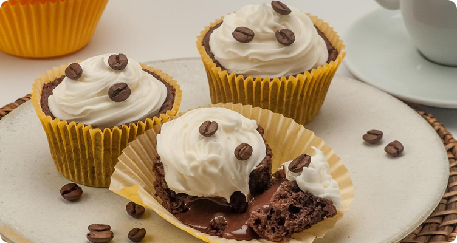

<h1 align="center">🎂 Página de receita</h1>

Projeto desenvolvido em aula na formação Full-Stack pela Rocketseat 💜

<a href="#-tecnologias">Tecnologias</a> |
<a href="#-projeto">Projeto</a>

---

---

## 🚀 Tecnologias

Esse projeto foi desenvolvido com as seguintes tecnologias:

- HTML
- CSS
- Git e Github
- Figma

---

## 💻 Projeto

Este projeto foi desenvolvido como parte da Formação Exclusiva da Rocketseat, com o objetivo de aprender e praticar os fundamentos de HTML e CSS.

O projeto consiste na criação de uma página web simples de receitas, aplicando conceitos essenciais como:

- Estruturação semântica do HTML  
- Estilização com CSS  
- Uso de listas  
- Links e imagens  

A ideia é consolidar o conhecimento básico necessário para construção de páginas estáticas, servindo como primeiro passo na jornada de desenvolvimento web. 🎨
